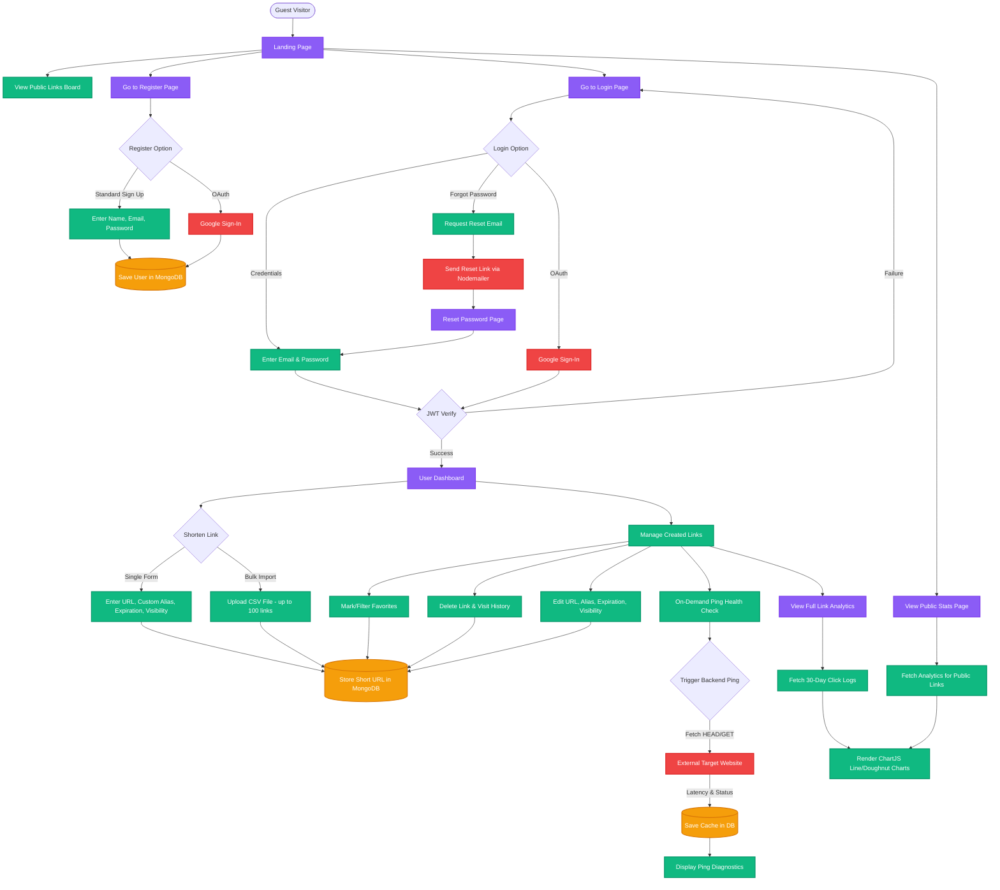
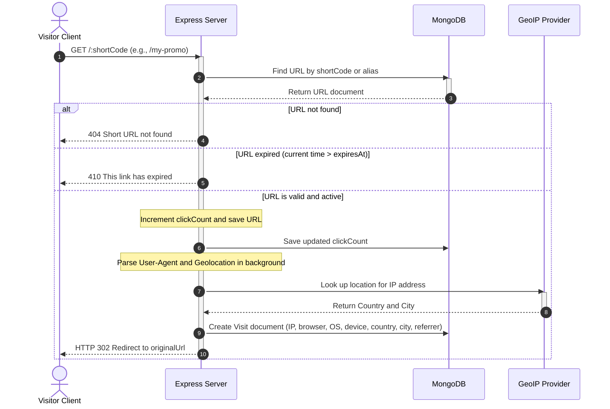
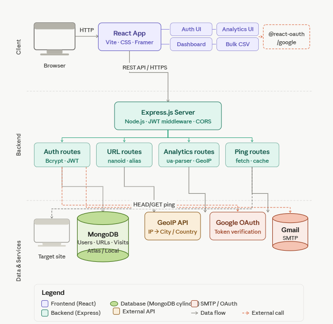
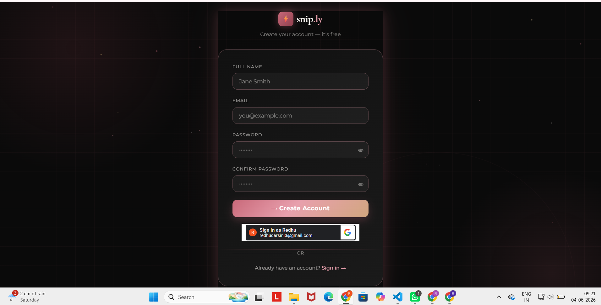
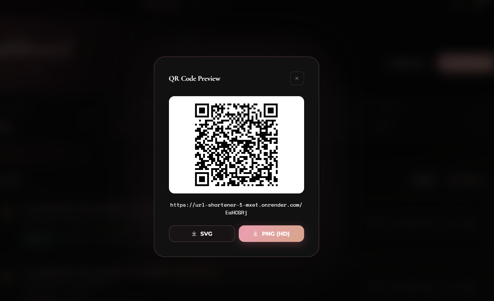
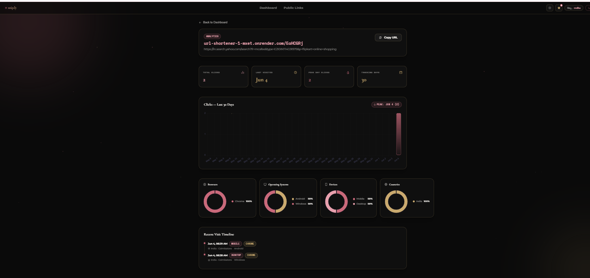

# snip.ly — Premium URL Shortener & Analytics Platform

snip.ly is a modern, full-stack link management platform built on a 3-tier architecture. It supports standard and Google OAuth authentication, custom URL alias creation, link expiration, bulk CSV importing, on-demand health checks, and a rich analytics suite with geolocation and device breakdowns.

---

## Setup Instructions

### Prerequisites

- **Node.js** v18.0.0 or higher
- **MongoDB** — a running local instance or a MongoDB Atlas connection string
- **Google OAuth Credentials** *(optional, for Google Login)*
- **Gmail Account & App Password** *(optional, for password reset emails)*

---

### 1. Backend Configuration

Navigate to the backend directory and install dependencies:

```bash
cd backend
npm install
```

Create a `.env` file inside the `backend/` directory:

```env
# Database
MONGO_URI=mongodb+srv://<username>:<password>@<cluster>.mongodb.net/<database_name>
PORT=5000

# Security
JWT_SECRET=your_jwt_signing_secret_here

# Frontend URL (for CORS and reset-password emails)
FRONTEND_URL=http://localhost:5173

# Nodemailer SMTP (for password reset emails)
EMAIL_USER=your_email@gmail.com
EMAIL_PASS=your_gmail_app_password

# Google OAuth
GOOGLE_CLIENT_ID=your_google_client_id_here
```

Start the backend server:

```bash
# Development (with hot-reload via nodemon)
npm run dev

# Production
npm start
```

The backend will be available at `http://localhost:5000`.

---

### 2. Frontend Configuration

Navigate to the frontend directory and install dependencies:

```bash
cd ../frontend
npm install
```

Create a `.env.development` file for local development:

```env
VITE_API_URL=http://localhost:5000
```

Create a `.env` file for production:

```env
VITE_API_URL=https://your-deployed-backend-url.com
FRONTEND_URL=https://your-deployed-frontend-url.com
VITE_GOOGLE_CLIENT_ID=your_google_client_id_here
```

Start the frontend development server:

```bash
npm run dev
```

The React application will be available at `http://localhost:5173`.

---

## Assumptions Made

1. **Node.js Runtime** — The system runs on Node.js v18+. Both backend and frontend packages use ES Modules (`"type": "module"`).
2. **Database Connection** — A MongoDB instance (local or Atlas) is active and reachable via the `MONGO_URI` connection string.
3. **Port Allocation** — The backend defaults to port `5000`; the Vite frontend defaults to port `5173`.
4. **Google OAuth** — The Google Client ID used in both `.env` files must belong to the same Google Cloud Console project, with `http://localhost:5173` whitelisted as an Authorized JavaScript Origin.
5. **Email SMTP** — Nodemailer uses Gmail SMTP. The sender account must have 2-Step Verification enabled, and the generated App Password must be supplied in `EMAIL_PASS`.
6. **Geolocation Accuracy** — IP-based geolocation is used for visitor analytics. Loopback addresses (`127.0.0.1`, `localhost`) resolve to unknown/local values since they have no global geographical mapping.

---

## AI Planning Document & Architecture

### Application Overview

snip.ly is composed of three primary layers:

- **Frontend** — A responsive React single-page application built with Vite, TailwindCSS, and Framer Motion.
- **Backend** — A stateless REST API on Node.js and Express handling short code generation, redirects, analytics aggregation, and authentication.
- **Database** — MongoDB as the persistent document store for users, URL mappings, and visitor analytics.

---

### Feature List

**Authentication & User Management**
- Secure email/password registration with Bcrypt hashing (salt round 12) and JWT sessions
- Google OAuth one-click login via `@react-oauth/google` and `google-auth-library`
- Forgot-password flow with secure timed reset tokens sent via Nodemailer (Gmail SMTP)

**Link Shortening & Management**
- Auto-generated unique 7-character short codes using `nanoid`
- Custom aliases (3–30 characters: letters, numbers, `-`, `_`) with reserved-word validation and uniqueness checks
- Optional expiration dates — expired links return HTTP 410 Gone
- Public/private visibility toggle with a community links board for public links
- Bulk creation via CSV upload (up to 100 links) using `papaparse`
- Favorites management for dashboard filtering
- Full edit and delete support including visit history cleanup

**Advanced Analytics**
- IP-based geolocation for Country and City lookup
- User-Agent parsing for browser, OS, and device type (Desktop, Mobile, Tablet) via `ua-parser-js`
- Referrer tracking (Direct, Twitter/X, GitHub, search engines, etc.)
- Interactive dashboards with 30-day click trend line charts and doughnut/bar breakdowns powered by `chart.js` and `react-chartjs-2`
- Shareable public analytics pages for links marked as public

**Link Health Checking**
- On-demand ping checks using backend `fetch` with abort timeouts
- Returns status (`live`, `redirect`, `dead`) and response time in milliseconds
- 5-minute cooldown cache stored in the database to optimize network usage

---

### Architectural Design Decisions

- **Stateless Authentication** — JWTs stored on the frontend client allow the backend to scale horizontally without database session lookups.
- **Background Analytics Processing** — Visit logging and IP geolocation run asynchronously after the redirect response is sent, keeping redirect latency minimal.
- **Strict Security Middleware** — Route-level `protect` middleware verifies JWT signatures, validates input, and enforces CORS against allowed origins.

---

### Application Workflow



---

### Visitor Redirection & Analytics Capture Sequence



---

### Architecture & Flow Diagrams

#### System Architecture Diagram


#### Application Redirection & Sequence Flow Chart


---

### Application Screenshots (Output Showcase)

Here are the output screenshots displaying the UI and core features of the application:

#### 1. Landing Page


#### 2. Authentication Page (Login & Register)


#### 3. Dashboard Page


#### 4. Link Creation


#### 5. Favourite Links


#### 6. QR Code Generation


#### 7. CSV Bulk Upload


#### 8. Generated Bulk Links


#### 9. Analytics Page


#### 10. Public Statistics

## Demo Video

Watch the complete walkthrough covering user onboarding, link shortening with custom aliases and expiration, bulk CSV upload, live redirection, health check pings, and the interactive analytics dashboard:

**YouTube Demo:** [Watch on YouTube](https://youtu.be/cbv5PnJi-A0)

---

*This project is a part of a hackathon run by https://katomaran.com*